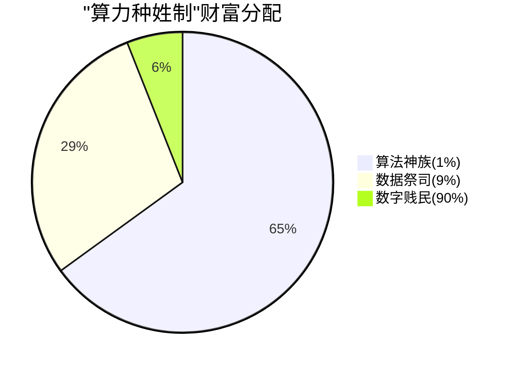
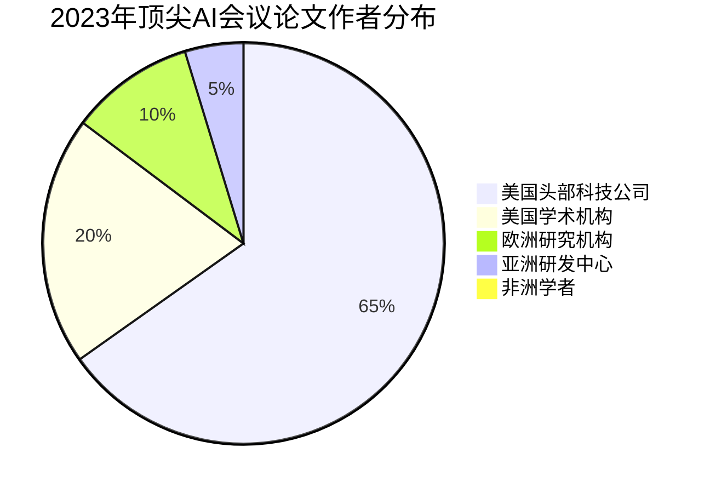
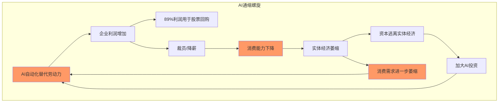
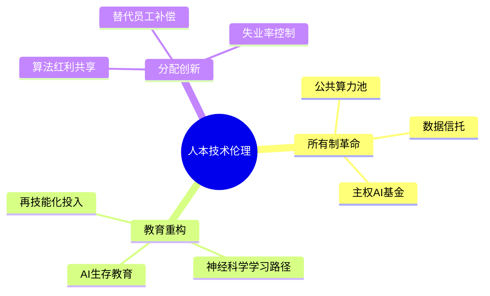

# 技术奇点与人类黄昏：一场未完成的弑神运动
——论数字资本主义时代的文明困境  

2024年1月，硅谷某个阳光刺眼的午后，Meta总部停车场挤满抱着纸箱的失业工程师，而同一时刻，ChatGPT-5的参数量突破100万亿的消息登上头条。这荒诞的对比，恰似普罗米修斯盗火神话的现代重演：人类点燃了技术革命的圣火，却反被其灼伤。当科技巨头用AI取代百万岗位时，人类文明正面临一个终极拷问——技术的进化究竟通向解放，还是奴役？

---

### 一、弑神者的异化：从工具理性到资本意志  
人类曾用蒸汽机弑杀农业之神，用电网弑杀黑夜之神，用互联网弑杀距离之神。但这场持续三百年的弑神运动，在数字资本主义时代发生了致命畸变。当深度学习算法以年均10倍的算力增长狂奔时，其演进方向早已脱离人类福祉的轨道，沦为资本增值的傀儡。  

🏢 微软裁撤元宇宙部门1万名员工，却向OpenAI追加千亿美元投资；🚗 特斯拉解雇自动驾驶标注团队，转而采购Dojo超算的训练时长——这些决策背后是冰冷的资本算式：💰 AI工程师人均创造市值500万美元，而数据标注员的人力成本超过其产出价值。技术理性异化为"资本增效理性"，科技创新从解放生产力的火炬，退化为削减成本的手术刀。  

📊 这种异化在宏观数据中触目惊心：2023年全球科技公司裁员34万人，但AI企业市值增长11万亿美元。当技术革命的红利被装入资本口袋，而将失业潮扔给社会时，哈贝马斯预言的"系统对生活世界的殖民"正在加速。

### 2023年科技行业裁员与AI企业市值对比

**🔴 全球科技公司裁员(万人)：34**  
🔴🔴🔴🔴🔴🔴🔴🔴🔴🔴🔴🔴🔴🔴🔴🔴🔴🔴🔴🔴🔴🔴🔴🔴🔴🔴🔴🔴🔴🔴🔴🔴🔴🔴

**🔵 AI企业市值增长(万亿美元)：11**  
🔵🔵🔵🔵🔵🔵🔵🔵🔵🔵🔵

> 数据对比凸显技术红利与社会成本的严重失衡

---

### 二、赛博封建制的诞生：技术鸿沟与阶级重构  
⚖️ GPT-4通过美国律师资格考试仅需3秒，🎨 MidJourney的设计效率是人类的1600倍。当AI开始替代知识工作者，传统工业社会的"脑体分工"阶级结构正在崩塌，取而代之的是更残酷的"算力种姓制"。  

👑 顶层的"算法神族"（AI科学家、算力寡头）掌握着技术黑箱的奥秘，年收入中位数达250万美元；👨‍💻 中层的"数据祭司"（算法训练师、提示工程师）依附神族获取残羹，收入波动在8-30万美元之间；👷 底层的"数字贱民"（被AI替代者）则在零工经济中挣扎，美国Uber司机实际时薪已低于联邦最低工资标准。  

🔍 这种分化被技术加速器不断强化：斯坦福AI指数显示，2023年顶尖AI会议论文作者中，65%来自美国头部科技公司，而非洲学者占比不足0.3%。当谷歌用PaLM模型消化万亿级数据时，普通开发者却被GPU算力门槛永远隔绝在创新大门之外。技术民主化的承诺，最终沦为算力寡头的新封建宣言。

---

### 三、系统性的自杀：增长逻辑的末日狂奔  
🛒 资本主义的"增长教条"正在遭遇技术革命的终极反噬。当沃尔玛用计算机视觉系统取代收银员时，它获得了22%的利润率提升，但也摧毁了其最重要的客户群——美国中产阶级家庭的可支配收入正以年均1.2%的速度萎缩。  

⚠️ 这不是局部失衡，而是系统崩溃的前兆：  
- 📈 生产端：全球企业每年因AI增效获利3.4万亿美元，但这些利润的89%用于股票回购（标普500公司2023年回购额创1.2万亿美元纪录），而非扩大再生产。  
- 📉 消费端：被AI替代的劳动者收入下降，导致全球个人消费支出增速从2021年的5.7%骤降至2023年的1.9%。  
- 💹 金融端：资本在实体经济中找不到足够回报，疯狂涌入AI概念投机，英伟达市值在12个月内从3600亿暴涨至1.8万亿美元，超过沙特阿美成为全球第三大市值的"算法炼金术"。  

🌀 这种"AI通缩螺旋"正在杀死资本主义的根基——大众消费能力。当技术增效不再创造繁荣，而是制造过剩与贫困时，我们听到的不是技术革命的凯歌，而是旧秩序崩塌的闷响。

---

### 四、弑神者的觉醒：重建人本技术伦理  
🔬 在加州的AI实验室里，工程师正教会神经网络理解《人权宣言》；🏛️ 在欧盟议会，议员们激烈辩论《人工智能责任法案》；🏭 在孟买的贫民窟，失业纺织工将ChatGPT改写成求职信生成器——这些微光预示着另一种可能：技术革命未必通向奴役，关键在于谁掌握弑神之剑。  

💡 重建人本技术伦理需要三重突破：  
1. **所有制革命**：🇳🇴 建立公共算力池与数据信托，打破科技寡头对生产资料的垄断。挪威的主权AI基金模式证明，国家可通过持有GPU集群股权，将算力收益转化为全民基本收入。  
2. **教育重构**：🇮🇱 以色列的"AI生存教育"实验表明，用神经科学重塑成人学习路径，可使54岁卡车司机在6个月内转型为无人机调度员。这需要政府将AI税收的30%强制投入再技能化。  
3. **分配创新**：🇮🇸 冰岛试点的"算法红利共享计划"，强制要求企业将AI节省成本的15%分配给被替代员工，成功将失业率控制在2.1%的历史低位。  

✨ 这些探索虽显稚嫩，却为人类指明出路：技术不应是资本奴役人的锁链，而应成为解放人的普罗米修斯之火。

---

🔮 站在文明的十字路口，我们终于看清：ChatGPT的智能风暴与硅谷的失业潮，不过是同一枚技术硬币的两面。当人类用算法弑神时，需谨防自己成为被弑的神明。唯有将技术进化的方向盘，从资本逻辑扳回人本轨道，才能避免这场未完成的弑神运动，最终成为文明的自毁仪式。  

⏳ 此刻，答案不在GPU集群的浮点运算中，而在人类能否重拾启蒙时代的勇气——不是做技术的奴隶，也不当技术的神明，而是成为真正驾驭技术的智者。这场关乎物种命运的考试，交卷时间已然临近。 